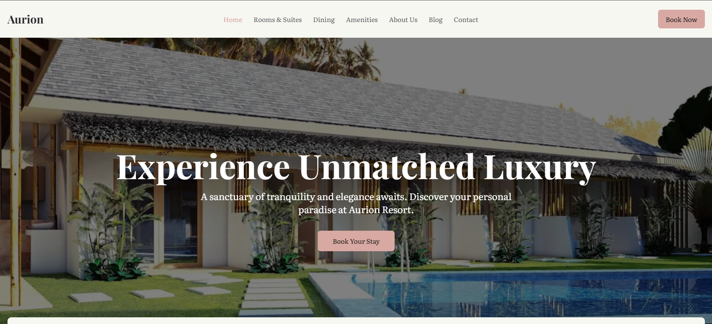
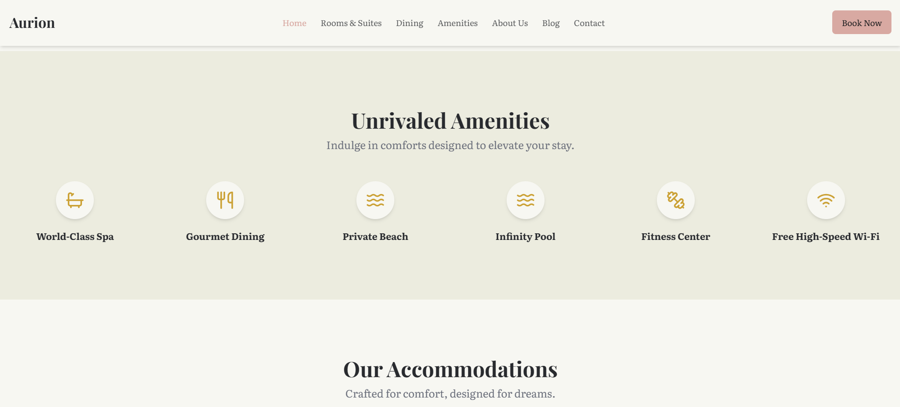
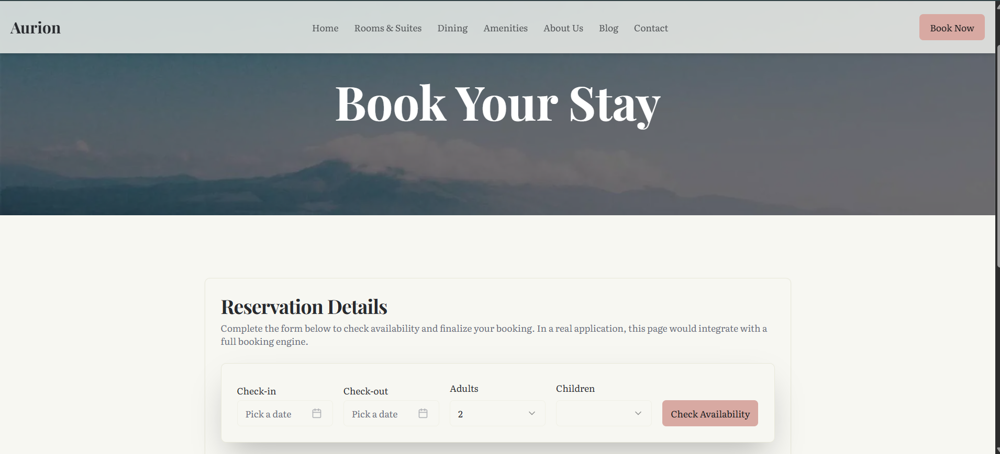

🏝️ Resort Website
A luxurious and modern Resort Booking Website designed to showcase resort facilities, attract customers, and provide a smooth booking experience.
 Built using HTML, CSS, JavaScript, and designed for performance, elegance, and responsiveness.

📁 Project Structure
resort_website/
├── assets/              # Images, icons, and media files
├── css/                 # All style files
│   └── style.css
├── js/                  # JavaScript functionality
│   └── main.js
├── pages/               # Additional pages (about, contact, rooms, etc.)
├── index.html           # Main landing page
└── README.md            # Project documentation

✨ Features
🏨 Elegant resort showcase with a modern user interface

📱 Fully responsive for all devices

🌊 Smooth scrolling and animation effects

🗗️ Booking form / inquiry section

🛍 Google Map integration (optional)

🤭 Easy navigation bar with dropdown menus

⚡ Optimized for fast loading speed

🛠️ Technologies Used
Category
Tools
Frontend
HTML5, CSS3, JavaScript
UI/UX
Responsive design, CSS animations

📦 Installation & Run Steps

If your project uses npm for live server or dependencies:

Clone the repository

git clone https://github.com/Suneesh-Vinayaga/resort_website.git

Navigate to the project folder

cd resort_website

Install dependencies (if applicable)

npm install

Run the project locally

🧩 Future Enhancements
💬 Add a working contact form with backend integration

🔒 Add authentication for booking management

🧾 Dynamic booking confirmation page

🧠 Convert to React / Next.js for scalability

📸 Screenshots

Home Page(Hero section):

Categories:

Book Now

